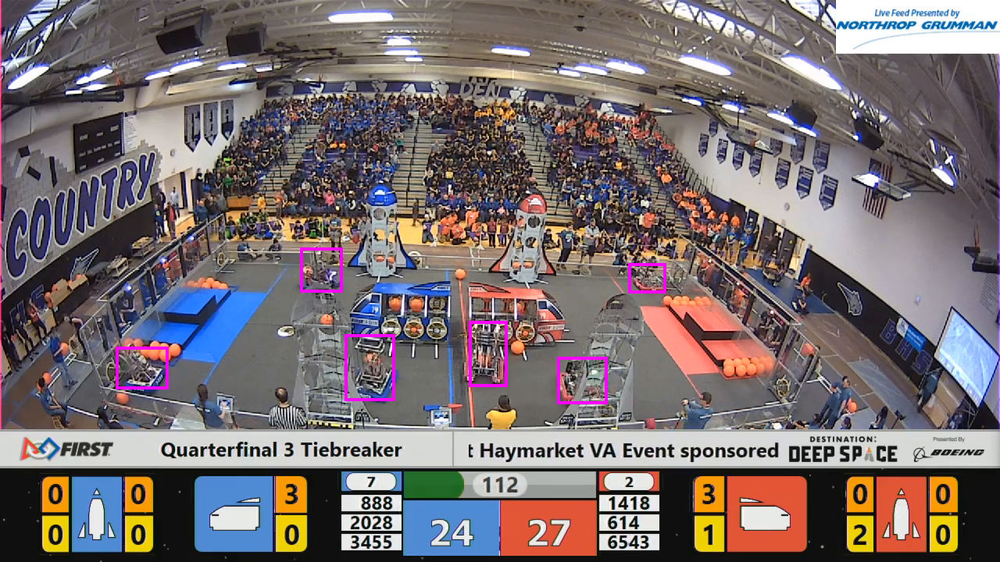
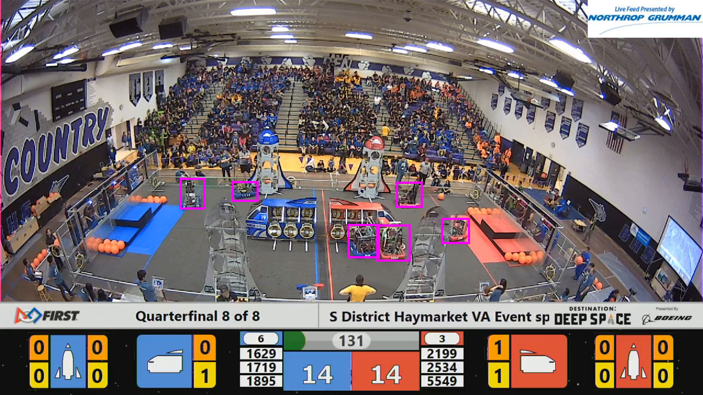

# Better Scouting™

The intent of this project is to attempt to automate at least a portion
of the otherwise tedious task of recording scouting data for FIRST
Robotics matches. Optimally, upon completion, the model would be
capable of taking match footage as input and producing an accurate
timeline of when a game piece is scored, where it is scored, and by
which team. This is, of course, an incredibly tall task with the
limited input, so we'll see where this takes us.

## Roadmap (Work in Progress)

Before focusing on determining when and where scoring is ocurring, the
first step is to be able to identify and track robots throughout the
course of a match. The following is a rough roadmap of the components
currently thought to be needed to complete this task:

- [x] A script to batch download match videos from The Blue Alliance
- [X] A script to extract arbitrary frames within matches for use in
training/testing data
- [X] Manually tagged bounding boxes on robots within match images
- [X] An object detection model trained on the bounding boxes dataset
- [ ] An object tracking model reinforced by the aforementioned object
detection model

The frame extraction code is based on identifying the start and end of
the match using the standard FRC start and end sounds. The process
consists of bandpass filtering the match audio to remove extraneous
frequencies, and then finding cross-correlation peaks between the match
audio and the sample audio features.

The robot detection uses the YOLO model and was trained using darknet.
The current weights were obtained after training for 4000 iterations
on a total of 253 images of manually tagged match footage. Here are some
examples of its output:

